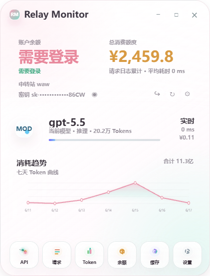
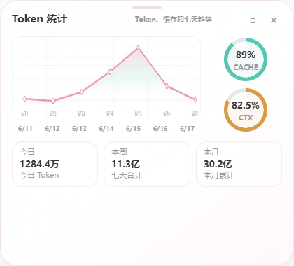
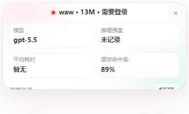

# Relay Monitor / 中转站监控

Relay Monitor 是一个面向 Windows 的 Electron 桌面工具，用来监控 `ccswitch` 当前中转站的真实请求、余额、Token、消费、缓存命中率、上下文消耗和平均耗时。它的目标不是估算本地客户端用了多少，而是尽量贴近中转站侧的真实账单与请求记录。



## 适合谁

- 使用 `ccswitch` 在多个中转站或 provider 之间切换的用户。
- 希望在桌面上常驻查看余额、今日消费、Token 趋势和最近请求的人。
- 希望区分“站点账户余额”和“API Token 配额”的开发者。
- 需要确认 UI、日志、诊断输出不会泄露明文 API key 或网页登录态的个人工具作者。

## 主要能力

| 能力 | 说明 |
| --- | --- |
| 当前中转站识别 | 从 `ccswitch` 当前 provider 读取名称、请求地址、模型和配置状态。 |
| 真实请求统计 | 从 `ccswitch` 请求日志或日汇总读取 Token、费用、耗时、模型和状态码。 |
| 余额读取 | 支持自动 API 探测、网页登录 session 读取和手动估算三种模式。 |
| 缓存与上下文 | 根据请求日志计算缓存命中、缓存写入、上下文窗口占用和剩余额度。 |
| 多窗口仪表盘 | 主窗口可打开 API、请求、Token、余额、缓存、设置等独立模块窗口。 |
| Codex 伴随悬浮条 | 可跟随 Codex 窗口显示短状态，复用同一份中转站快照。 |
| 明文密钥防护 | 主进程读取必要密钥，渲染进程、IPC、诊断和 UI 只显示脱敏值。 |

## 界面预览

更多界面说明见 [程序界面导览](docs/interface-guide.zh-CN.md)，截图索引见 [UI 预览说明](docs/ui-preview/README.md)。

### 主仪表盘

主仪表盘用于扫视当前中转站、余额、总消费、模型、最近趋势和已打开模块。界面尽量保持桌面工具的密度，不做营销首页。

### Token 模块

Token 模块展示今日、本周、本月用量、七天趋势、缓存命中率和上下文占用，适合单独打开常驻观察。



### 伴随悬浮条

Codex 伴随悬浮条复用同一份中转站快照，显示当前 provider、今日 Token、余额状态和关键指标。



## 快速开始

### 环境要求

- Windows 10 或更新版本。
- Node.js `>=18.17`。
- 已安装并配置 `ccswitch`，且本机存在 `ccswitch` 配置或请求数据库。

### 安装依赖

```powershell
git clone https://github.com/WALLE424/RelayMonitor.git
cd RelayMonitor
npm install
```

### 启动开发版

```powershell
npm start
```

如果需要持续开发，也可以运行：

```powershell
npm run dev
```

### 打包 Windows 版本

```powershell
npm run dist:win
```

打包产物输出到：

```text
<project-root>\dist
```

当前配置会生成 NSIS 安装版和便携版。安装版允许选择安装目录。

## 常用命令

| 命令 | 作用 |
| --- | --- |
| `npm run check` | 对主进程、preload、relay、renderer 和脚本做 JS 语法检查。 |
| `npm test` | 运行 Node.js 内置测试。 |
| `npm run smoke` | 启动 Electron 最小冒烟检查。 |
| `npm run diagnose` | 输出当前中转站快照诊断，不显示明文密钥。 |
| `npm run preview` | 生成或捕获界面预览。 |
| `npm run dist:win` | 构建 Windows 安装版和便携版。 |
| `npm run clean` | 清理项目内打包输出。 |

## 项目结构

```text
<project-root>
├─ src
│  ├─ main          Electron 主进程、窗口、托盘、IPC、余额登录窗口和悬浮条跟随逻辑
│  ├─ preload       暴露给渲染进程的受限安全 API
│  ├─ renderer      中文毛玻璃界面、独立仪表盘、设置页和趋势图
│  ├─ relay         ccswitch 数据库、provider、余额和快照聚合
│  ├─ collectors    从中转站请求数据计算缓存命中率和上下文消耗
│  └─ shared        时间、格式化、密钥脱敏和共享工具
├─ docs             数据源、构建验证、计划和界面说明
├─ scripts          开发、检查、诊断、截图和 Windows 打包入口
├─ tests            主进程、relay、collector 和 renderer 测试
└─ package.json     npm 脚本和 Electron Builder 配置
```

## 数据来源与口径

默认读取：

```text
%USERPROFILE%\.cc-switch\settings.json
%USERPROFILE%\.cc-switch\cc-switch.db
```

核心原则：

- 当前中转站以 `ccswitch` 选中的 provider 为准。
- 请求模型和推理强度优先取最近真实请求；没有真实请求时显示未检测或未记录。
- Token、消费、平均耗时、缓存命中率、上下文消耗和 7 天趋势只从中转站请求日志或日聚合数据计算。
- Codex、Claude 或其他客户端只是使用该中转站的入口，不再作为独立用量来源。
- 切换中转站后，快照会按当前 provider 过滤请求日志、趋势和余额缓存。

详细说明见 [数据源说明](docs/data-sources.zh-CN.md)。

## 余额读取方式

Relay Monitor 不会在余额读取失败时伪装成 `¥0.00`。它会显示“需要登录 / 提取失败 / 未配置 / 读取失败 / 页面不匹配”等状态，避免把未知状态误读成余额为零。

| 模式 | 适用场景 | 说明 |
| --- | --- | --- |
| 自动接口 | 中转站提供余额或用量 API | 使用 provider 配置或常见 API 候选地址读取。 |
| 网页登录 | 余额只在后台页面可见 | 打开内置登录窗口，用户手动登录后读取页面或接口返回。 |
| 手动估算 | 无法自动读取余额 | 用初始余额减去中转站累计消费，并明确标记为估算。 |

网页登录方式可能需要在设置中填写余额页地址或 CSS 选择器。程序保存 Cookie/session 以便读取页面，但不会保存网页登录密码。

## 安全与隐私

- 明文 API key 只在主进程内读取，用于必要的中转站接口请求。
- 渲染进程只接收 `maskedKey` 或 `keyPreview`。
- IPC、诊断输出、UI 和错误信息不输出明文密钥、网页登录密码或 Cookie 明文。
- 打包产物不包含用户目录下的配置、数据库或登录态。
- `.gitignore` 默认排除 `node_modules/`、`dist/`、`tmp/`、`.env*`、`data/`、`secrets.json` 和本地设置文件。

开源发布前建议执行：

```powershell
npm run check
npm test
```

也建议额外扫描本地私密配置和临时截图，确认没有把个人中转站信息提交到仓库。

## 配置提示

应用会优先使用默认 `ccswitch` 路径。如果你的 `ccswitch` 配置或数据库在其他位置，可以在设置页中填写自定义路径。

常见状态含义：

| 状态 | 含义 | 建议 |
| --- | --- | --- |
| 未配置 | 没有找到可用数据源或余额配置。 | 检查 `ccswitch` 路径和 provider 配置。 |
| 需要登录 | 网页模式下 session 不存在或已过期。 | 打开余额登录窗口重新登录。 |
| 提取失败 | 页面可访问，但没有提取到余额字段。 | 填写余额页地址或 CSS 选择器。 |
| 页面不匹配 | 余额页面和当前 provider host 不一致。 | 切换到当前 provider 对应后台页面。 |
| Token 不限额 | API Token 配额不限，但不等同于账户余额。 | 使用网页登录读取站点账户余额。 |

## 开发说明

这个项目目前是 CommonJS + Electron 结构，没有引入前端框架。主进程负责读取本机 `ccswitch` 数据、余额登录窗口、托盘和窗口管理；渲染进程负责生成仪表盘 HTML、设置页、趋势图和模块窗口。

测试使用 Node.js 内置测试框架：

```powershell
npm test
```

语法检查使用 `node --check`：

```powershell
npm run check
```

构建和验证细节见 [构建与验证说明](docs/build-and-verify.zh-CN.md)。

## 许可证

本项目基于 [MIT License](LICENSE) 开源。
