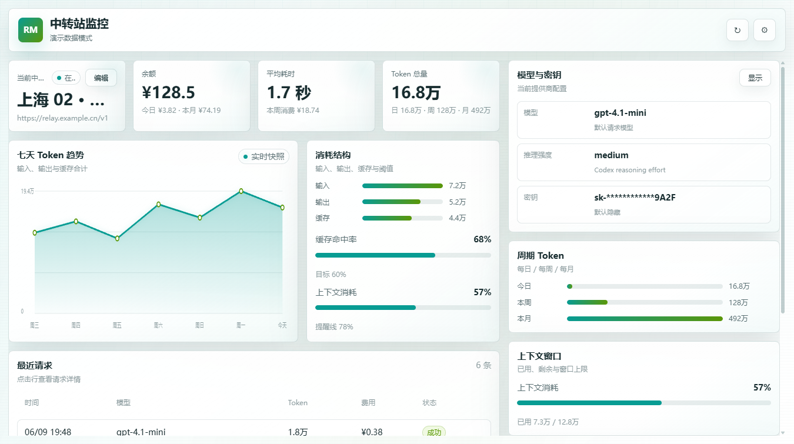
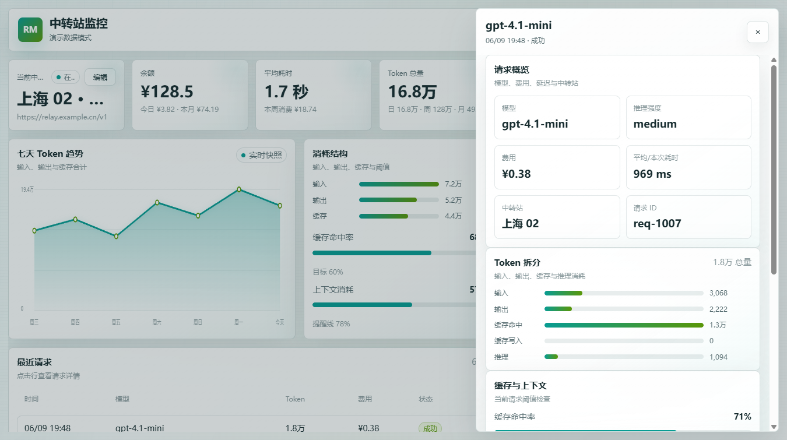
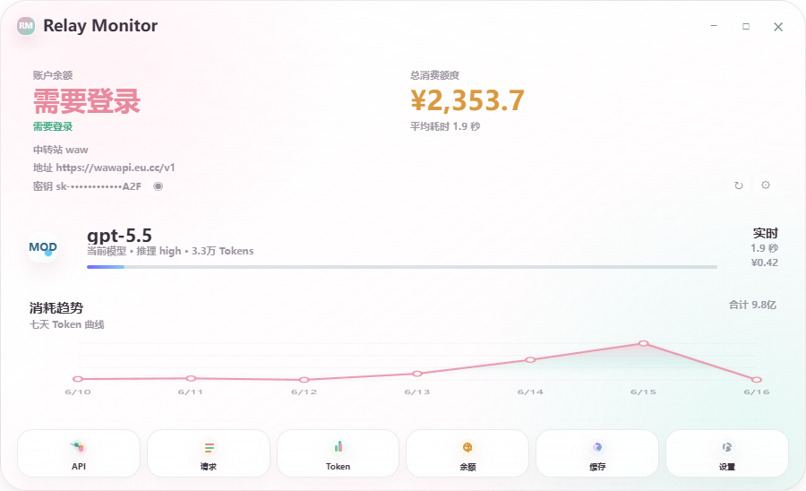
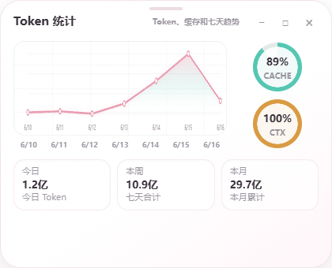
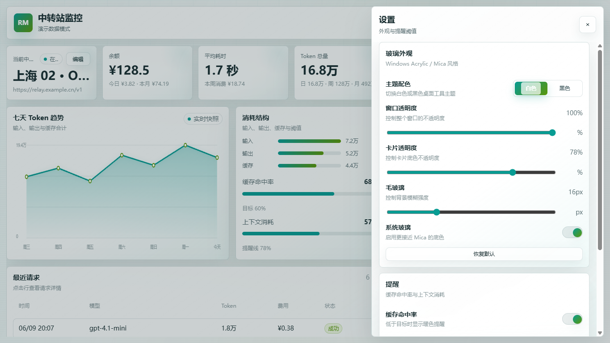
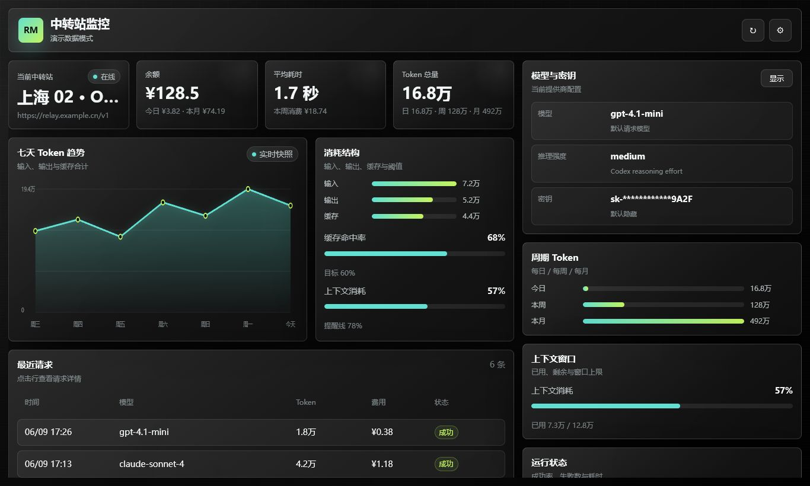

# 程序界面导览

这份文档说明 Relay Monitor 的主要界面、信息层级和使用场景。它面向使用者、维护者和后续贡献者，用来快速理解每个窗口应该展示什么、避免展示什么。

## 界面原则

- 首屏直接进入监控仪表盘，不做营销页。
- 信息优先级从高到低是：余额状态、当前中转站、今日消耗、最近请求、风险提示、详细设置。
- 界面文案保持中文短句，适合常驻桌面时快速扫视。
- 密钥、Cookie、网页登录密码和本机配置内容不进入渲染层明文展示。
- 余额未知时展示明确状态，不用 `¥0.00` 伪装未知结果。

## 主仪表盘

主仪表盘是应用的核心界面，承担“扫一眼就知道当前中转站是否正常”的任务。

| 区域 | 展示内容 | 设计意图 |
| --- | --- | --- |
| 余额卡片 | 账户余额、总消费、读取状态和刷新入口 | 把最容易产生误判的信息放在首位。 |
| Provider 信息 | 当前中转站名称、请求地址、脱敏密钥 | 帮助确认正在使用哪个 provider。 |
| 模型卡片 | 最近请求模型、推理强度、Token 和平均耗时 | 反映当前调用实际落在哪个模型上。 |
| 趋势图 | 近 7 天 Token 曲线和合计 | 用趋势判断异常增长或使用高峰。 |
| Dock | API、请求、Token、余额、缓存、设置入口 | 保持主界面紧凑，同时允许展开细节。 |

状态处理：

- 没有请求日志时，Token 和消费显示为无记录或 0，并保留来源说明。
- 当前余额需要网页登录时，主卡片显示“需要登录”，并暴露登录入口。
- 页面或 provider 不匹配时，显示“余额页面不匹配”，避免误读旧站点余额。

## 请求详情界面

请求详情用于核对最近真实请求，不从客户端本地会话估算数据。

展示内容：

- 最近请求列表。
- 请求时间、模型、推理强度、状态码和耗时。
- 输入、输出、缓存读取、缓存写入和总 Token。
- 单次费用和数据来源。
- 当前 provider 关联信息。

## API 模块

API 模块用于展示当前 provider 和可识别的候选 provider。它只展示必要的中转站元信息，不展示明文密钥。

应展示：

- 当前 provider 名称和请求地址。
- 是否为 `ccswitch` 当前选中项。
- 脱敏后的 key 预览。
- 关联模型或默认模型。

不应展示：

- 完整 API key。
- 原始鉴权 header。
- 用户目录下的完整私密配置内容。

## Token 模块

Token 模块聚焦请求用量和缓存效率。

展示内容：

- 今日、本周、本月 Token。
- 输入、输出、缓存读取、缓存写入。
- 缓存命中率。
- 上下文窗口、已用上下文和剩余上下文。
- 近 7 天趋势。

这个模块适合常驻打开，用于判断缓存策略是否有效、上下文是否接近上限。

## 余额模块

余额模块用于解释“余额从哪里来”和“为什么读不到”。

展示内容：

- 账户余额或当前状态。
- 今日、本周、本月和总消费。
- 读取来源：自动 API、网页登录、手动估算或请求日志 fallback。
- 读取接口或页面地址的安全版本。
- 失败原因和建议操作。

关键规则：

- API Token 配额不限不等同于站点账户余额。
- 读取失败时展示状态和建议，不展示假余额。
- 当余额页面 host 与当前 provider host 不一致时，提示页面不匹配。

## 缓存与上下文模块

缓存模块帮助判断请求是否有效复用上下文缓存。

展示内容：

- 缓存读取 Token。
- 缓存写入 Token。
- 缓存未命中 Token。
- 命中率。
- 当前模型上下文窗口。
- 已用和剩余上下文。

## 设置界面

设置界面集中管理数据源、余额读取、外观和窗口行为。

| 分组 | 选项 |
| --- | --- |
| 数据源 | `ccswitch` settings 路径、数据库路径、刷新频率。 |
| 余额读取 | 自动接口、网页登录、手动估算、余额页 URL、CSS 选择器。 |
| 外观 | 浅色/深色、透明度、模糊强度、模块显示方式。 |
| 窗口行为 | 置顶、关闭按钮行为、伴随悬浮条、独立模块窗口尺寸。 |
| 安全预览 | 是否显示脱敏 key 预览，不提供明文展示。 |

设置页的输入要经过主进程白名单和归一化处理，避免渲染进程写入任意路径或未知字段。

## Codex 伴随悬浮条

伴随悬浮条用于跟随 Codex 窗口显示紧凑状态，适合边写代码边看中转站消耗。

紧凑态展示：

- 当前 provider 名称。
- 今日 Token。
- 余额或余额状态。

展开态展示：

- 今日消费。
- 最近模型。
- 余额读取状态。
- 当前请求地址的简短提示。

伴随悬浮条和主仪表盘共用同一份快照，不重复读取数据库或余额页面。

## 明暗主题和外观

界面支持浅色和深色两种主视觉，并提供透明度、模糊和窗口尺寸调整。

- 浅色主题用于日常桌面常驻，降低压迫感。
- 深色主题用于低亮度环境或深色桌面。
- 透明和模糊是辅助效果，不能影响文字可读性。
- 卡片信息密度要高，但不使用嵌套卡片堆叠。

## 错误状态和空状态

| 场景 | 界面表现 |
| --- | --- |
| 找不到 `ccswitch` 数据库 | 显示未配置或数据缺失，并提示检查路径。 |
| 当前 provider 没有请求日志 | 使用当前 provider 信息，但 Token 和趋势显示无记录。 |
| 余额 API 返回 401 | 显示需要登录，不把余额置为 0。 |
| 余额页面无法解析 | 显示提取失败，并建议填写 CSS 选择器。 |
| 页面 host 与 provider 不一致 | 显示页面不匹配，提示切换余额页。 |
| 明文 key 出现在 provider 配置 | 主进程用于请求，渲染进程只拿脱敏结果。 |

## 截图维护建议

- 截图应使用示例 provider、示例余额和示例 Token。
- 不要提交真实中转站后台、真实消费截图、真实 API key 或 Cookie。
- 新增界面截图时优先放入 `docs/ui-preview`。
- 文件名建议包含界面名称和状态，例如 `relay-monitor-balance-auth-required.png`。
